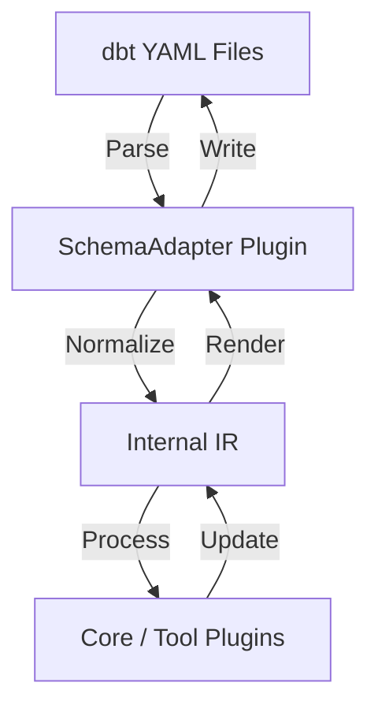

# 4. Decoupled dbt Property Version Adapters

Date: 2026-02-16

## Status

Accepted

## Context

dbt property schemas (the structure of `.yml` files for models, sources, snapshots, etc.) evolve over time. For example, dbt Core 1.10 introduced significant changes (moving `meta` and `tags` into `config`, changing `tests` to `data_tests`), and dbt Fusion (v2) continues this evolution.

`dbt-helpers` needs to:

1. Support multiple versions of dbt projects (Core 1.10+ and Fusion).
2. Facilitate migrations between these versions.
3. Remain maintainable as future versions are released.

Tightly coupling the core logic to a specific dbt version would lead to "version hell" and make the codebase fragile.

## Decision

We will decouple the dbt property schema handling by introducing a pluggable `SchemaAdapter` architecture.

1. **Stable Internal IR**: The Core Orchestrator and Tool Plugins will operate on a single, stable Internal Representation (IR) of dbt resources (defined in the SDK).
2. **SchemaAdapter Port**: We define a `SchemaAdapter` interface in the SDK that plugins must implement to support specific dbt YAML versions.
3. **Bi-directional Mapping**: Each adapter is responsible for:
   - **Parsing**: Converting version-specific YAML into the stable internal IR.
   - **Rendering**: Converting internal IR back into the version-specific YAML layout.
4. **Pluggable Implementation**: Specific versions (e.g., `v2`, `fusion`) are implemented as separate plugins registered via entry points (`dbt_helpers.schema_plugins`).
5. **User Selection**: Users specify their `target_version` in `dbt_helpers.yml`.

### Architecture Diagram

## Consequences

- **Maintainability**: Adding support for a new dbt version only requires a new `SchemaAdapter` plugin, not a rewrite of the core.
- **Flexibility**: `dbt-helpers` can support projects at different stages of migration.
- **Migration Support**: The core can load a project using an old adapter and save it using a new one, providing built-in migration paths.
- **Isolation**: Core logic remains agnostic of specific dbt YAML keyword changes (e.g., `tests` vs `data_tests`).
- **Overhead**: Requires maintaining the mapping logic in each adapter, but this is less risky than spreading version-specific logic throughout the core.
