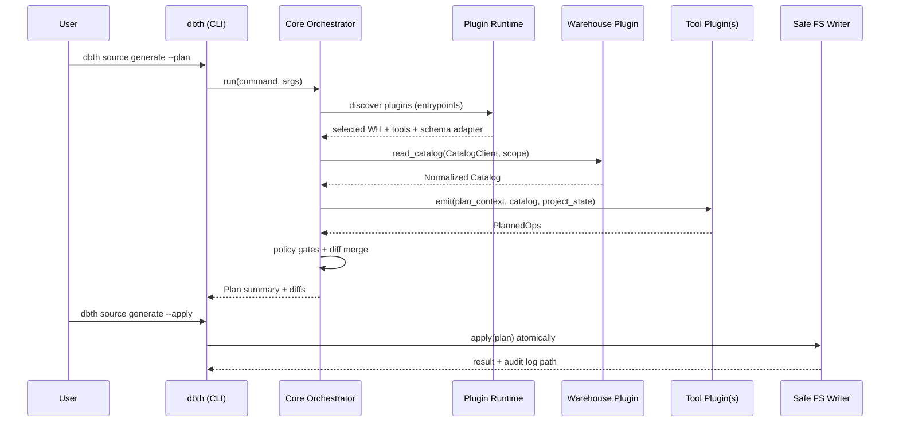

# dbt-helpers System Design

## Executive Summary

The `dbt-helpers` project is designed as a modular, extensible, and high-performance toolkit for managing dbt projects, specifically focusing on automation, YAML patching, and warehouse integration. The core architectural philosophy is based on a **Hexagonal Architecture** where "Plugin SDK contracts" serve as the control plane.

By stabilizing these contracts early, all other components (CLI UX, warehouse support, integrations like Lightdash/Elementary, YAML patching, and migration support) become replaceable adapters. This design ensures that the system remains agnostic to specific warehouse implementations while providing a safe, idempotent, and auditable environment for dbt project management.

### Key Design Pillars

- **Hexagonal Core**: Domain logic, orchestration, and plan/diff engine are separated from IO and external adapters.
- **Plugin-First**: Functionality is extended via warehouse and tool plugins discovered via Python entry points.
- **Safety & Idempotency**: Plugins operate through restricted interfaces (`CatalogClient`) and propose changes via a "Plan API" rather than direct file system access.
- **Monorepo Strategy**: Utilizing `uv` workspace for a multi-package architecture to maintain strict dependency boundaries.

---

## Project Structure

The project is organized as a `uv` workspace monorepo. Source code for each package resides under the `src/` directory.

```text
dbt-helpers/
├── pyproject.toml               # uv workspace root
├── uv.lock                      # Lockfile for reproducibility
├── src/
│   ├── dbt_helpers_sdk/         # Stable contracts, IR types, and test harness
│   │   ├── pyproject.toml
│   │   └── src/dbt_helpers_sdk/
│   ├── dbt_helpers_core/        # Orchestrator, Plan Engine, YAML Patcher
│   │   ├── pyproject.toml
│   │   └── src/dbt_helpers_core/
│   ├── dbt_helpers_cli/         # Typer-based CLI interface
│   │   ├── pyproject.toml
│   │   └── src/dbt_helpers_cli/
│   └── plugins/
│       ├── warehouses/
│       │   ├── dbt_helpers_wh_bigquery/  # BigQuery warehouse adapter
│       │   └── dbt_helpers_wh_duckdb/    # DuckDB warehouse adapter
│       ├── tools/
│       │   ├── dbt_helpers_tool_lightdash/ # Lightdash integration
│       │   ├── dbt_helpers_tool_elementary/ # Elementary integration
│       │   └── dbt_helpers_tool_privacy/  # Data privacy and PII masking
│       └── schemas/
│           ├── dbt_helpers_schema_v2/    # dbt Core 1.10+ schema adapter
│           └── dbt_helpers_schema_fusion/ # dbt Fusion schema adapter
├── docs/
│   ├── core/
│   │   └── system_design.md    # This document
│   └── adr/                    # Architecture Decision Records
└── .github/workflows/          # CI/CD pipelines
```

### Dependency Rules

- `dbt_helpers_sdk`: No dependencies on other internal packages.
- `dbt_helpers_core`: Depends on `dbt_helpers_sdk`.
- `dbt_helpers_cli`: Depends on `dbt_helpers_core` and `dbt_helpers_sdk`.
- `plugins`: Depend on `dbt_helpers_sdk` and external connectors (e.g., `google-cloud-bigquery`). Plugins should **not** depend on `dbt_helpers_core` directly.

---

## Plugin SDK Contracts

The SDK is the public surface area that enables independent plugin development and ensures long-term stability.

### Goals and Non-goals

- **Goals**: Independent publishing, stable interfaces, strict safety boundaries, deterministic generation, and multi-namespace mapping.
- **Non-goals**: Not a dbt parser/fusion replacement; not an infinite SQL templating engine.

### SDK Components

- **Interfaces**: Protocols/ABCs for ports.
- **Value Objects**: Canonical Data Models (IR).
- **Plan API**: Structured operations for file changes.
- **Test Harness**: Conformance tests to ensure plugin health.

### Canonical Data Model (IR)

The Intermediate Representation (IR) ensures the core remains warehouse-agnostic.

#### 1. Warehouse Catalog IR

Uses a hierarchical namespace model that degrades gracefully.

- `CatalogNamespace`: List of parts (e.g., `["project", "dataset"]` for BigQuery).
- `CatalogRelation`: Namespace + name + kind (table/view/etc) + metadata (`Dict[str, Any]`).
- `CatalogColumn`: Name, type, nullability, description, tags, constraints + metadata (`Dict[str, Any]`).

The `metadata` field enables a **Producer/Consumer pattern** for plugin collaboration:

- **Producers**: Warehouse plugins attach warehouse-specific details (e.g., `bigquery.partition_info`, `bigquery.policy_tags`).
- **Consumers**:
  - Tool plugins (like Lightdash) read these details to automate configuration (e.g., setting default filters).
  - The Privacy tool reads `policy_tags` to suggest dbt-level data privacy classifications.

#### 2. dbt Resource IR

Represents dbt resources without a `dbt-core` dependency. This IR serves as the **source of truth** for all versioned `SchemaAdapter` plugins.

- `DbtModelRef`, `DbtSourceRef`, `DbtSnapshotRef`.
- `DbtYamlDoc`: A wrapper for round-trip YAML manipulation.

### The Plan API: "Plugins Propose, Core Applies"

Plugins return a `Plan` consisting of `PlannedOp` objects:

- `CreateFile(path, content)`
- `UpdateYamlFile(path, yaml_patch_ops)`
- `DeleteFile(path)` (gated by flags)
- `AddDiagnostics(level, message)`

### Plan/Apply Workflow

To ensure safety and auditability, `dbt-helpers` follows a two-phase execution model similar to Terraform:

1. **Planning Phase**: The tool reads the warehouse catalog and project state to generate a `Plan`. This plan can be visualized with rich diffs or saved to a JSON file using the `--out` flag.
2. **Application Phase**: The saved plan is applied to the project using the `dbth apply <plan.json>` command. This phase can be run after a human review or as part of a CI/CD pipeline.

Inline application using the `--apply` flag on generation commands is deprecated in favor of this explicit two-phase workflow.

---

## System Architecture

### Core Workflow

1. **Configuration**: Load `dbt_helpers.yml`.
2. **Discovery**: Load plugins via entry points.
3. **State Building**: Index existing dbt resources and file locations.
4. **Discovery**: Read warehouse metadata via the restricted `CatalogClient`.
5. **Planning**: Execute emitters (plugins) to generate `PlannedOps`.
6. **Human Audit**: Display plan via `--plan`.
7. **Atomic Execution**: Apply changes with backups and audit logs.

### Data Flow Diagram



### Project Configuration Model

The `dbt_helpers.yml` file defines the project settings and plugin configurations.

```yaml
warehouse:
  plugin: "bigquery"
  connection:
    project_id: ${BQ_PROJECT_ID}
  namespace_policy:
    # Default mapping rules
    default_project: "my-analytics-project"

paths:
  # Path templates per resource kind
  model: "models/{{ project }}/{{ dataset }}/{{ table }}.sql"
  source: "models/{{ project }}/{{ dataset }}/sources/{{ source_name }}.yml"
  snapshot: "snapshots/{{ table }}.sql"

dbt_properties:
  # The target dbt YAML version (v2, fusion, etc.)
  target_version: "v2"

tools:
  lightdash:
    enabled: true
  elementary:
    enabled: true
  privacy:
    enabled: true
    objectives:
      data_analysis:
        data_handling_standards:
          confidential:
            method: SHA256
            converted_level: internal
```

### Path and Naming Policy

`dbt-helpers` uses a lightweight, dependency-free templating system for resolving file paths and resource names.

#### Templating Syntax

- **Syntax**: `{{ variable }}` (e.g., `models/{{ dataset }}/{{ table }}.sql`).
- **Logic**: Uses simple regex-based substitution to keep the project lightweight and avoid dependencies like Jinja2. No functions, macros, or filters are supported to maintain simplicity.

#### Available Variables

Variables are derived from the `CatalogRelation` and `CatalogNamespace` objects:

- `project` / `database`: The top-level namespace part.
- `dataset` / `schema`: The second-level namespace part.
- `table` / `identifier`: The relation name.
- `kind`: The relation kind (e.g., `table`, `view`).
- `namespace_0`, `namespace_1`, ...: Positional namespace parts for warehouses with varying depths.

#### Warehouse Defaults

- **BigQuery**: Defaults to `models/{{ project }}/{{ dataset }}/{{ kind }}/{{ table }}.sql`.
- **DuckDB / Postgres**: Defaults to `models/{{ schema }}/{{ table }}.sql`.

#### Path Resolution

The `PathPolicy` component resolves these templates at runtime. If a user provides an override in `dbt_helpers.yml`, it takes precedence over warehouse-specific defaults.

### Handling dbt YAML version drift

To support different dbt property schemas (e.g., dbt Core 1.10+ vs. dbt Fusion), `dbt-helpers` uses pluggable `SchemaAdapter` components.

#### SchemaAdapter Principle

- **Decoupling**: The Core and Tool Plugins never interact with version-specific YAML keywords. They only work with the SDK's stable internal IR.
- **Normalization**: When reading a dbt project, the selected `SchemaAdapter` parses version-specific YAML and normalizes it into the internal IR.
- **Rendering**: When generating or updating files, the `SchemaAdapter` renders the internal IR back into the target YAML version layout.
- **Migration**: Migration between dbt versions (e.g., Core 1.10 to Fusion) is handled by loading the project with one adapter and writing it back with another, orchestrated by the Core.

### Safety & Governance

- **Capability-based Access**: Plugins only get a `CatalogClient` with specific, logged capabilities. No arbitrary SQL execution by default.
- **Impersonated Authentication**: For BigQuery, the system supports Service Account impersonation. This ensures that the orchestrator (or the user running it) only acquires short-lived credentials with specific scopes, providing a hardened audit trail.
- **Path Sandboxing**: Core enforces that all file operations occur within the project root.
- **Privacy Protected Models**: The Privacy tool plugin automates the creation of "masked" dbt models. By consuming metadata from the catalog and existing dbt resources, it generates SQL views that apply hashing (e.g., SHA256) or drop sensitive columns, ensuring that PII never reaches downstream consumers.
- **Audit Logging**: Every action, catalog call, and file change is recorded in a JSONL audit log.

### YAML Editing Strategy

Uses `ruamel.yaml` in a dedicated `YamlStore` subsystem.

- **Goal**: Zero churn for untouched nodes, comment preservation.
- **Operations**: `EnsureMappingKey`, `SetScalar`, `MergeSequenceUnique`, `UpsertListOfMappings`.

### Testing Strategy

`dbt-helpers` follows a **Hexagonal Architecture** with a focus on **Functional Core, Imperative Shell**. This design is reflected in our testing strategy, which prioritizes speed, reliability, and the avoidance of brittle mocks.

#### 1. Philosophy: Nullable Infrastructure

We avoid using standard mocking libraries (`unittest.mock`) for infrastructure. Instead, we use the **Nullable Infrastructure** pattern.

- **Unit Tests**: Test core logic using "Nullable" versions of adapters. These are real implementations that use in-memory state (e.g., in-memory DuckDB for catalogs, memory-backed filesystems) to ensure tests are fast and deterministic without external I/O.
- **Integration Tests**: Verify the actual production adapters against real infrastructure using **Testcontainers**.
  - **Multi-Version Testing**: Integration tests run against a matrix of dbt flavors (Core, Fusion) and versions (e.g., 1.10, 1.11). This is orchestrated via `nox` and uses parameterized Docker builds to ensure compatibility across the dbt ecosystem.
  - **Directory-Based Fixtures**: Support for loading realistic dbt projects (like `jaffle_shop`) from disk as test fixtures, ensuring compatibility with standard project structures.

#### 2. Test Organization

Tests are co-located with their respective packages to maintain strict boundaries and modularity.

- `src/<package>/tests/unit/`: Logic and orchestration tests using Nullable adapters.
- `src/<package>/tests/integration/`: Container-based tests for infrastructure adapters.

#### 3. Levels of Testing

- **SDK Level**: Contract and mapping stability tests. Ensures the IR remains stable.
- **Core Level**: Plan merge, conflict resolution, and orchestration logic using Nullable adapters.
- **Plugin Level**:
  - **Warehouse Plugins**: Integration tests against real database containers (Postgres, DuckDB).
  - **Tool Plugins**: Emitter tests using fixture-based catalogs.
- **End-to-End**: Full CLI execution against sample dbt projects (stored in `integration_tests/`) with golden output comparison.

---

## Reasoning & Validation

### Why this design?

1. **Isolation**: By decoupling from `dbt-core`, we avoid version hell and performance bottlenecks.
2. **Stability**: The small SDK footprint allows the ecosystem to grow without constant breakages.
3. **Safety**: The "Plan" model makes the tool safe for production use by allowing human review before execution.

### Validation Checklist

- [ ] Can a third-party plugin be written using only the `dbt_helpers_sdk`?

- [ ] Does a second run with the same state produce an empty plan (Idempotency)?
- [ ] Are YAML comments preserved during complex patching?
- [ ] Does the BigQuery namespace mapping correctly handle multi-project/dataset hierarchies?
- [ ] Is arbitrary SQL execution effectively blocked for standard plugins?
